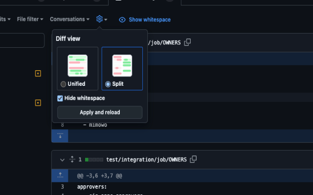

# GitHub PR hide whitespaces

This is a simple browser extension that will automatically hide whitespaces for all your GitHub PRs.

At times, the whitespaces in the PRs can be distracting and make it difficult to read the code. This extension will help you focus on the code changes and not the whitespaces.

While GitHub has [added support to remember whitespace settings for individual PRs](https://github.blog/changelog/2021-10-14-hiding-whitespace-is-now-remembered-for-each-pull-request/).
They have yet to add user-level settings to control this across _all_ PRs, and by the [looks of it](https://github.com/orgs/community/discussions/5486#discussioncomment-1541120) they aren't planning on doing so any time soon.

The extension is very simple and does the following:
- Redirects on PR review pages to the same URL with the `w=1` query parameter added, which will lead to whitespaces being hidden.

## Installation

The extension is available for both Chrome and Firefox. At the current time, it's not yet published to the offical extension stores, so you'll have to install it manually.

1. Download the ZIP archive from the [latest release](https://github.com/dhaus67/hide-whitespaces-extension/releases/latest).
2. For Chrome:
    - Unzip the archive.
    - Go to `chrome://extensions/` in your browser.
    - Enable Developer mode.
    - Click on "Load unpacked" and select the unzipped folder.
3. For Firefox:
    - Unzip the archive.
    - Go to `about:debugging#/runtime/this-firefox` in your browser.
    - Click on "Load Temporary Add-on" and select the `manifest.json` file from the unzipped folder.
4. Now whenever you are visiting a PR review page (e.g. `https://github.com/octo-org/repo/pull/123/files`) the whitespaces will be hidden automatically and the page will be reloaded.
